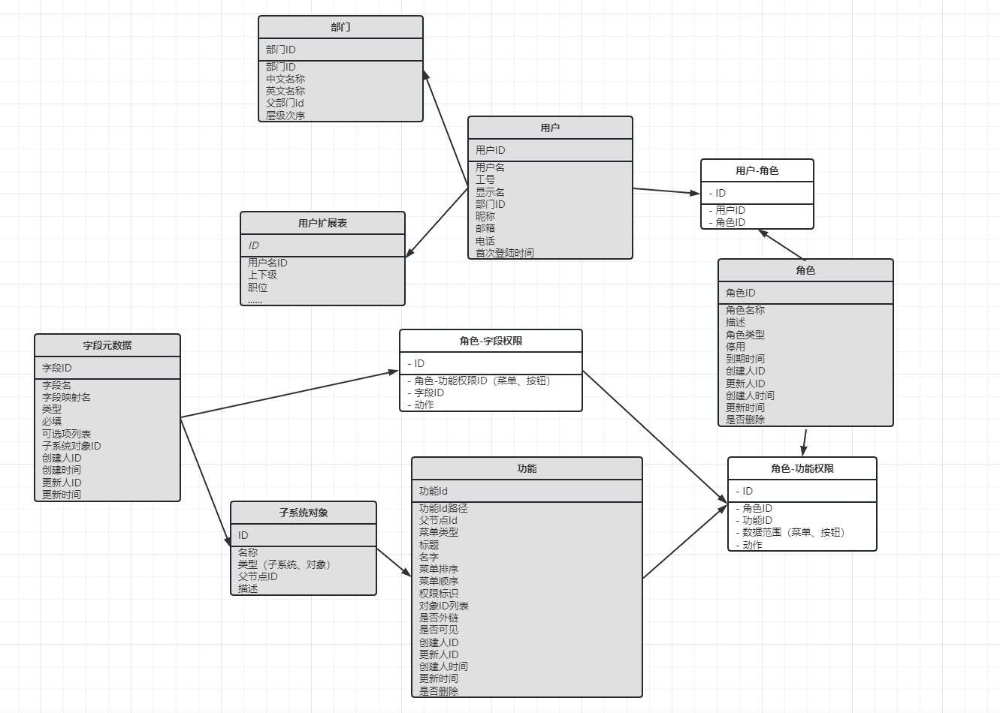

# 系统管理
管理系统。 项目参考： https://eladmin.vip/pages/010101/  
## 系统管理
功能列表  
* [部门管理](#部门管理)：部门组织架构，树形表格展示，用于限制数据范围   
* [权限管理](#权限管理)：可以动态管理菜单权限（list、add、edit、del），目录-菜单-按钮-字段（默认/可选）  
* [角色管理](#角色管理)：菜单权限（包括字段）和数据范围关联到角色，用户加入角色分配响应权限，支持批量导入用户  
* [用户管理](#用户管理)：用户的相关配置，用户信息从SSO和企业微信同步，支持批量用户分配权限  
* [字段管理](#字段管理)：支持自定义配置字段和显示名的映射，数据库字段映射配置  

### 部门管理
部门组织架构，树形表格展示，只进行展示，定期从[企业微信](https://developer.work.weixin.qq.com/document/path/90208)进行同步
用于以下作用
* 对用户分组展示
* 限制数据范围（查看本级、下级、其他部门、自定义、下级递归）
* 角色配置时可以添加部门，该部门下的所有用户批量绑定到角色  
* 手动同步， 使用同步数据库


### 权限管理
动态添加菜单列表， 按照"目录-菜单-按钮（CRUD）"顺序配置， 菜单级增加同步字段列表
* 菜单类型分为：目录-菜单（list）-按钮(\add\edit\del)[-字段]
* 加载目录时，一个目录为一个对象，菜单级信息，登陆时返回菜单级结构目录 ([{"type","key","children":{}}, {...}])
* 菜单排序规则，同一个父节点ID下目录按数字排序，可调整排序顺序，前端拖拽，上传 index
* 添加子集菜单或按钮权限时，同时添加父级权限  
* 路径分为内链/外链，内链规则：目录/菜单(system/user)， 外链规则： http[s]://
* 权限命名规则，菜单:list\add\edit\del  
* 字段需在菜单级下手动同步（在用户角色添加字段权限，菜单管理只做展示），字段来源调用接口
* 菜单删除使用软删除，删除时判断是否有绑定的角色
* 隐藏接口，管理员硬删除
* 右侧导航最多三级菜单


数据结构  
权限表：
```text
-- techadmin.sys_menu definition

CREATE TABLE `sys_menu` (
  `id` varchar(20) NOT NULL COMMENT '菜单ID',
  `parentid` varchar(20) NOT NULL COMMENT '父节点ID',
  `full_path` varchar(100) NOT NULL COMMENT '菜单ID路径',
  `title` varchar(30) NOT NULL COMMENT '菜单标题',
  `name` varchar(30) DEFAULT NULL COMMENT '组件名称',
  `menu_type` tinyint(4) DEFAULT NULL COMMENT '菜单类型',
  `menu_sort` int(11) DEFAULT NULL COMMENT '排序',
  `permission` varchar(200) DEFAULT NULL COMMENT '权限标识',
  `link` varchar(200) DEFAULT NULL COMMENT '链接地址',
  `link_type` tinyint(4) DEFAULT NULL COMMENT '链接类型',
  `field_map` text COMMENT '字段列表',
  `hidden` tinyint(1) DEFAULT NULL COMMENT '是否隐藏',
  `create_by` varchar(50) DEFAULT NULL COMMENT '创建人ID',
  `create_time` datetime DEFAULT NULL COMMENT '创建时间',
  `update_by` varchar(50) DEFAULT NULL COMMENT '更新人ID',
  `update_time` datetime DEFAULT NULL COMMENT '更新时间',
  `is_deleted` tinyint(1) DEFAULT NULL COMMENT '是否删除',
  `deleted_time` datetime DEFAULT NULL COMMENT '删除时间',
  PRIMARY KEY (`id`)
) ENGINE=InnoDB DEFAULT CHARSET=utf8;
```

### 用户管理
用户管理，默认创建系统用户，其他用户通过SSO登陆后创建，可批量选择角色
* 添加几个默认一用户
* SSO没有部门、上下级信息，需查询企业微信进行关联  
* 添加角色，展示角色列表，配置到用户-角色列表

数据结构  
用户表：
```text
-- techadmin.sys_user definition

CREATE TABLE `sys_user` (
  `id` varchar(50) NOT NULL COMMENT '用户ID',
  `user_name` varchar(100) DEFAULT NULL COMMENT '用户名',
  `display_name` varchar(100) DEFAULT NULL COMMENT '显示名',
  `first_name` varchar(50) DEFAULT NULL COMMENT '名',
  `last_name` varchar(50) DEFAULT NULL COMMENT '姓',
  `nick_name` varchar(100) DEFAULT NULL COMMENT '昵称',
  `birthday` date DEFAULT NULL COMMENT '生日',
  `user_type` tinyint(3) unsigned DEFAULT NULL COMMENT '用户类型',
  `company_name` varchar(100) DEFAULT NULL COMMENT '所属公司名',
  `mobile` varchar(20) DEFAULT NULL COMMENT '电话',
  `email` varchar(50) DEFAULT NULL COMMENT '邮箱',
  `time_diff` int(10) unsigned DEFAULT NULL,
  `oem_brand` varchar(100) DEFAULT NULL,
  `language` varchar(20) DEFAULT NULL COMMENT '语言',
  `first_login_time` datetime DEFAULT NULL COMMENT '首次登陆时间',
  PRIMARY KEY (`id`)
) ENGINE=InnoDB DEFAULT CHARSET=utf8;
```

用户表扩展：部门、上下级信息


### 角色管理
角色可配置数据范围、菜单权限、字段权限， 可批量选择用户
* 权限配置顺序：数据范围-菜单权限-字段权限 （不同菜单需看不同数据范围时，可以创建多个角色配置不同数据范围）
* 数据范围（全部，本级、本级和下级、自定义），数据需要和部门关联，一般是人员信息相关
* 添加菜单权限、树状展示，选择角色时展示菜单列表，勾选的菜单保存批量添加/删除权限
* 增加和删除时，读取角色权限列表，和现有提交数据对比，删除历史权限，增加新的权限
* 菜单级和按钮级可开启字段展示，关闭时使用默认字段，开启时展示字段列表
* 添加用户权限，部门树状结构，批量选择用户
* 删除角色需要判断是否有绑定的菜单、用户
* 角色类型分为内部/外部基础角色(基础权限、登陆时绑定)、虚拟角色（扩展权限）等，虚拟角色权限大
* 角色和权限有allow和deny的效果，尽量使用allow， 特殊情况下用 deny 进行限制
* 权限的生效到期时间，零时权限（后期功能）

数据结构  
角色表：
```text
-- techadmin.sys_role definition

CREATE TABLE `sys_role` (
  `id` varchar(20) NOT NULL COMMENT '角色ID',
  `name` varchar(100) DEFAULT NULL COMMENT '角色名',
  `type` tinyint(4) DEFAULT NULL COMMENT '角色类型',
  `description` varchar(500) DEFAULT NULL COMMENT '角色描述',
  `is_deactivate` tinyint(1) DEFAULT NULL COMMENT '是否停用',
  `expires_time` datetime DEFAULT NULL COMMENT '生效时间',
  `create_by` varchar(50) DEFAULT NULL COMMENT '创建人ID',
  `create_time` datetime DEFAULT NULL COMMENT '创建时间',
  `update_by` varchar(50) DEFAULT NULL COMMENT '更新人ID',
  `update_time` datetime DEFAULT NULL COMMENT '更新时间',
  `is_deleted` tinyint(1) DEFAULT NULL COMMENT '是否删除',
  PRIMARY KEY (`id`)
) ENGINE=InnoDB DEFAULT CHARSET=utf8;
```
角色-权限表：
```text
-- techadmin.sys_role_menu definition

CREATE TABLE `sys_role_menu` (
  `id` varbinary(20) NOT NULL COMMENT 'ID',
  `role_id` varchar(20) DEFAULT NULL COMMENT '角色ID',
  `menu_id` varchar(20) DEFAULT NULL COMMENT '菜单ID',
  `data_scope` varchar(50) DEFAULT NULL COMMENT '数据权限',
  `field_scope` varchar(200) DEFAULT NULL COMMENT '字段权限',
  `effect` varchar(10) DEFAULT NULL COMMENT '效果',
  PRIMARY KEY (`id`)
) ENGINE=InnoDB DEFAULT CHARSET=utf8;
```
角色-用户表：
```text
-- techadmin.sys_role_user definition

CREATE TABLE `sys_role_user` (
  `id` varchar(20) NOT NULL COMMENT 'ID',
  `role_id` varchar(20) DEFAULT NULL COMMENT '角色ID',
  `user_id` varchar(50) DEFAULT NULL COMMENT '用户ID',
  PRIMARY KEY (`id`)
) ENGINE=InnoDB DEFAULT CHARSET=utf8;
```


### 字段管理
可根据权限下字段列表，配置显示名的映射关系，某些可选项下拉列表配置
* 字段以 `子系统.对象` 进行分组
* 权限的字段ID列表中可调用多个字典ID
* 后期可配置获取字段可选项， 静态、动态下拉列表 
* 分公共字段（精简），以及项目字段， name由前端固定
* 关于required字段，第一次提交后设置required，在公共里头有的是optinal, 不在公共部分的是required
* 删除，允许删除，但是设置一个时间，用**定时任务**实际删除, 删除前前端需要校验输入name是否是对的，防止不必要的删除
* 恢复，加一个字段回收箱功能，在删除未过期时间内，都可以恢复，但是需要先检查是否和现有的冲突，冲突的不允许恢复
* 修改，除name其余字段都可修改   


数据结构  
字段数据：  
```text
-- techadmin.sys_field definition

CREATE TABLE `sys_field` (
  `id` varchar(20) NOT NULL COMMENT '字段ID',
  `name` varchar(50) NOT NULL COMMENT '字段名',
  `label` varchar(50) DEFAULT NULL COMMENT '字段名称',
  `type` varchar(20) DEFAULT NULL COMMENT '字段类型',
  `required` tinyint(1) DEFAULT NULL COMMENT '必选',
  `values` text COMMENT '可选项列表',
  `object_id` varchar(20) DEFAULT NULL COMMENT '子系统对象ID',
  `create_by` varchar(50) DEFAULT NULL COMMENT '创建人ID',
  `create_time` datetime DEFAULT NULL COMMENT '创建时间',
  `update_by` varchar(50) DEFAULT NULL COMMENT '更新人ID',
  `update_time` datetime DEFAULT NULL COMMENT '更新时间',
  `delete_time` datetime DEFAULT NULL COMMENT '删除时间',
  PRIMARY KEY (`id`)
) ENGINE=InnoDB DEFAULT CHARSET=utf8 COMMENT='字段元数据';
```  
子系统对象数据： 

```text
-- techadmin.sys_field_subsystem_object definition

CREATE TABLE `sys_field_meta` (
  `id` varchar(20) NOT NULL COMMENT 'ID',
  `name` varchar(20) DEFAULT NULL COMMENT '系统',
  `type` varchar(20) DEFAULT NULL COMMENT '类型',
  `parent_id` varchar(50) DEFAULT NULL COMMENT '对象',
  `description` varchar(100) DEFAULT NULL COMMENT '描述',
  PRIMARY KEY (`id`)
) ENGINE=InnoDB DEFAULT CHARSET=utf8;   
```

### 角色字段权限
角色功能权限关联字段，配置字段的白名单/黑名单权限
* 可以绑定到菜单、按钮的权限
* 默认为权限下所有字段，黑名单>默认字段>白名单，示例：
```text
功能1有 A、B、C、D、E、F 字段，用户绑定了角色a和角色b
1.角色a 对 功能1 有白名单A、B、C， 角色b 对 功能1 有默认配置， 则用户有功能1的全部字段权限
2.角色a 对 功能1 有白名单A、B、C， 角色b 对 功能1 有白名单C、D， 则用户有功能1的A、B、C、D
3.角色a 对 功能1 有白名单A、B、C， 角色b 对 功能1 有黑名单A、B， 则用户有功能1的C、D、E、F
```


### 数据库ER图



### 接口规则
所有list接口都是分页的， `total`、`page`、`size` 、 `list` , 尽可能重用结构体

所有list查询支持根据某些字段查询， 自定义filter字段  
 
接口返回命名规范： 小写， 多单词用_  

### 接口
所有路由以`/api` 开头  

## 认证

登录， sso登陆， 系统返回，系统缓存token,   
url: `/auth/login`    
method: `get`    
resp: 302 return_url + token

获取用户信息  
url: `/auth/user_info`    
method: `get`   
resp: 
```json
{
  "code": 0,
  "data": {
    "id":"",
    "name": "",
    "display_name": "",
    "nick_name": "",
    "birthday": "",
    "user_type": 1,
    "company_name": "",
    "mobile": "",
    "email": "",
    "language": "",
    "department": "",
    "position": "",
    "avatar": ""
  },
  "message": "successful"
}
```

### 人员

人员列表-企业内部员工
//TODO 排序，优先级很低
//TODO 变更：如果是系统用户，有系统用户名
url: `/sys/user/employee`  
method: `get`  
params:

| 字段名 | 类型 | 是否必须 | 描述 |
| ---- | ---- | --- | ---- |
| page | int | 是 | 页数 |
| size | int | 是 | 每页数量 |
| name | string | 否 | 用户名，模糊查询 |
| department | string | 否 | 部门 |
| position | string | 否 | 岗位 |
| gender | int | 否 | 性别 |
| is_local | boolean | 否 | 是否是sso登录过 |


resp //TODO, 附属信息:   
```json
{
  "code": 0,
  "data": {
    "list": [{
      "id": "",
      "display_name": "", 
      "department": "", 
      "position": "", 
      "gender": 1,
      "mobile": "", 
      "email": "",
      "extattr_local": ""
    }],
    "page": 1,
    "size": 10,
    "total": 100
  },
  "message": "successful"
}
```

人员列表-系统用户
//TODO 排序，优先级很低
//TODO 变更：如果是企业用户，有企业用户名
url: `/sys/user/local`  
method: `get`  
params:

| 字段名 | 类型 | 是否必须 | 描述 |
| ---- | ---- | --- | ---- |
| page | int | 是 | 页数 |
| size | int | 是 | 每页数量 |
| name | string | 否 | 用户名，模糊查询 |
| user_type | int | 否 | 用户类型 |
| is_employee | boolean | 否 | 是否是企业微信员工 |
| gender | int | 否 | 性别 |


resp //TODO， 附属信息:   
```json
{
  "code": 0,
  "data": {
    "list": [{
        "company_name": "",
        "email": "",
        "extattr": [],
        "first_login_time": "2023-06-16 07:39:10",
        "id": "vd1g25xingoblpq",
        "is_employee": true,
        "mobile": "",
        "display_name": "",
        "user_type": 0
      }],
    "page": 1,
    "size": 10,
    "total": 100
  },
  "message": "successful"
}
```

根据用户ID，查系统用户具体(包括权限)信息  
//todo 权限，角色信息，等角色绑定后回来做
url: `/sys/user/local/:user_id`  
method: `get`  
resp:   
```json
{
  "code": 0,
  "data": {
    "user_detail": {
      "id": "",
      "name": "", 
      "department": "", 
      "position": "", 
      "gender": 1, 
      "user_type": 1, 
      "company_name": "", 
      "mobile": "", 
      "email": ""
    }
  },
  "message": "successful"
}
```

编辑系统人员的附属数据
目前只处理一种text的情况，其余情况先不处理，结构 external_attr:   
```
"type": 0,
"name": "文本名称",
"text": {
		"value": "文本"
}
```
url: `/sys/user/local/:user_id`  
method: `put`  
params: {}   
resp: 
```json
{
  "code": -1,
  "data": {},
  "message": "某个失败原因"
}
```

编辑员工的附属数据    
url: `/sys/user/local/:user_id`  
method: `put`  
params: {}   
resp: 
```json
{
  "code": -1,
  "data": {},
  "message": "某个失败原因"
}
```

【待定】企业内部员工手动同步, 勾选特定人员进行同步  
url: `/sys/user/employee/sync`  
method: `put`  
params:  员工id
resp:  

系统人员绑定批量角色，rewrite这个人所有的角色  
url: `/sys/user/local/:user_id/role`  
method: `post`  
params:  

| 字段名 | 类型 | 是否必须 | 描述 |
| ---- | ---- | --- | ---- |
| role_list | list(id) | 是 | 角色ID列表 |
resp:   
成功  
```json
{
  "code": 0,
  "data": {},
  "message": "successful"
}
```  
失败  
```json
{
  "code": 0,
  "data": {
    "failed_list": [{
      "id": "",
      "name": ""
    }]
  },
  "message": "successful"
}
```

企业内部人员预绑定角色，如果是系统用户，直接绑定，关联上

### 部门

部门列表，分页（size无限大）  
url: `/sys/department`  
method: `get`      
params:

| 字段名 | 类型 | 是否必须 | 描述 |
| ---- | ---- | --- | ---- |
| page | int | 是 | 页数 |
| size | int | 是 | 每页数量 |
| name | string | 否 | 部门名 |
| name_en | string | 否 | 部门英文名 |

resp:   
```json
{
  "code": 0,
  "data": {
    "list": [{
      "id": "",
      "name": "", 
      "name_en": "", 
      "department_leader": "", 
      "parentid": 1,
      "order": 111
    }],
    "page": 1,
    "size": 10,
    "total": 100
  },
  "message": "successful"
}
```

包含部门下的员工，有权限的查看,分页（size无限大） 
//TODO 部门人员id   
url: `/sys/department/user`  
method: `get`  
params: 

| 字段名 | 类型 | 是否必须 | 描述 |
| ---- | ---- | --- | ---- |
| department_ids | list(int) | 是 | 部门ID列表 |

resp:   
```json
{
  "code": 0,
  "data": {
    "list": [{
      "id": "",
      "name": "", 
      "department_id": 0
    }, {
      "id": "",
      "name": "", 
      "department_id": 1
    }]
  },
  "message": "successful"
}
``` 

手动同步，沟选特定的同步, 失败的提示  
url: `/sys/department`  
method: `put`  
params: [department_id...]
resp: code=0, data={}, message='successful'   
code=-1, data={fail_list:[{department_id, name}]}, message=''  

### 功能管理  

获取个人左侧功能列表      
url: `/sys/menu/personal`   
method: `get`
resp:  
```json
{
  "code": 0,
  "data": {
    "list": [{
      "id": 1,
      "parentid": 0,
      "title": "一级目录",
      "type": 1,
      "hidden": true,
      "link_type": 1,
      "page_key": "",
      "link": "/sys/menu",
      "index": 2
      }, {
      "id": 7,
      "parentid": 1,
      "title": "二级目录",
      "type": 2,
      "hidden": true,
      "link_type": 2,
      "page_key": "",
      "link": "https://images..",
      "index": 1
    }]
  },
  "message": "successful"
}
```

功能管理，获取全部功能列表   
url: `/sys/menu`   
method: `get`
resp:  
```json
{
  "code": 0,
  "data": {
    "list": [{
      "id": 1,
      "parentid": 0,
      "title": "一级目录",
      "type": 1,
      "hidden": true,
      "link_type": 1,
      "link": "/sys/menu",
      "index": 2,
      "page_key": "",
      "object_id": "",
      object_name: "",
      object_description: ""
      }, {
      "id": 7,
      "parentid": 1,
      "title": "二级目录",
      "type": 2,
      "hidden": true,
      "link_type": 2,
      "link": "https://images..",
      "index": 1,
      "object_id": "",
      object_name: "",
      object_description: ""
    }]
  },
  "message": "successful"
}
```

单个菜单下的所有按钮级别功能列表  
url: `/sys/menu/:menu_id/permission`  
method: `get`  
resp:  
```json
{
  "code": 0,
  "data": {
    "list": [{
      "id": 1,
      "parentid": 0,
      "title": "增加用户",
      "type": 3,
      "hidden": false,
      "permission": "User:add",
      "link_type": 1,
      "link": "/sys/menu",
      "page_key": "",
      "index": 2
      }]
  },
  "message": ""
}
```

获取个人菜单下功能列表  
url: `/sys/menu/:menu_id/permission/personal`  
method: `get`  
resp:  
```json
{
  "code": 0,
  "data": {
    "list": [{"permission": "user:add"}]
  },
  "message": ""
}
```

新增功能， 区分是什么级别, 链接类型（1-内链路由（`#/sys`）、2-内链iframe(`https://images`)、3-外链(`https：//`)）    
url: `/sys/menu/permission`  
method: `post`  
params: 

| 字段名 | 类型 | 是否必须 | 描述 |
| ---- | ---- | --- | ---- |
| parentid | int | 是 | 父节点ID |
| title | string | 是 | 功能名 |
| type | int | 是 | 菜单类型 |
| page_key | string | 是 | 页面Key |
| permission | string | 否 | 权限标识 |
| link | string | 是 | 链接 |
| link_type | int | 是 | 链接类型 |
| hidden | boolean | 是 | 隐藏 |
| object_id | string | 是 | 子系统对象id |

resp:  
```json
{
  "code": 0,
  "data": {},
  "message": "successful"
}
```

修改功能  
url: `/sys/menu/permission/:permission_id`  
method: `put`   
params: 

| 字段名 | 类型 | 是否必须 | 描述 |
| ---- | ---- | --- | ---- |
| parentid | int | 是 | 父节点ID |
| title | string | 是 | 权限名 |
| type | int | 是 | 菜单类型 |
| page_key | string | 是 | 页面Key |
| permission | string | 否 | 权限标识 |
| link | string | 是 | 链接 |
| link_type | int | 是 | 链接类型 |
| hidden | boolean | 否 | 隐藏 |
| object_id | string | 是 | 子系统对象id |

resp:  
```json
{
  "code": 0,
  "data": {},
  "message": "successful"
}
```

软删除, 有关联的不给删， 删除失败时data返回关联的角色  
url: `/sys/menu/permission/`  
method: `delete`   
params:   

| 字段名 | 类型 | 是否必须 | 描述 |
| ---- | ---- | --- | ---- |
| permission_ids | list[id] | 是 | 权限Id列表 |

resp:   
成功
```json
{
  "code": 0,
  "data": {},
  "message": "successful"
}
```
失败
```json
{
  "code": 0,
  "data": {
    "failed_list": [{
      "id": 1,
      "name": "新增用户",
      "reason": "" 
    }]
  },
  "message": ""
}
```

菜单树结构拖拽改排序(全量)   
url: `/sys/menu/sort`   
method: `put`   
params:  

| 字段名 | 类型 | 是否必须 | 描述 |
| ---- | ---- | --- | ---- |
| order_index | list(json{id, index}) | 是 | 菜单排序列表 |

resp:  
成功
```json
{
  "code": 0,
  "data": {},
  "message": "successful"
}
```

根据功能，查所绑定的角色列表（包含权限信息）  
url: `/sys/menu/permission/:permission_id/role`   
method: `get`   
resp:   
```json
{
  "code": 0,
  "data": {
    "list": [
      {"id": 1, "name":  "", "purview": {"data_scope", "field_scope": [], "effect": ""}}
    ]
  },
  "message": "successful"
}
```

根据功能，查所绑定的人员（仅查看）  
url: `/sys/menu/permission/:permission_id/user`   
method: `get`   
resp:  
```json
{
  "code": 0,
  "data": {
    "list": [
      {"id": "1", "name":  ""}
    ]
  },
  "message": "successful"
}
```

功能绑定多个角色， 检查role_ids下功能ID，存在就覆盖

url: `/sys/menu/permission/:permission_id/role`   
method: `put`   
params:  

| 字段名 | 类型 | 是否必须 | 描述 |
| ---- | ---- | --- | ---- |
| role_ids | list(role_id) | 是 | 角色ID列表 |
| data_scope | int | 是 | 数据范围 |
| field_scope | list(id) | 是 | 字段范围 |
| effect | string | 是 | 动作 |

resp:  
成功
```json
{
  "code": 0,
  "data": {},
  "message": "successful"
}
```


### 角色管理


角色信息列表, 分页 , filter 条件查、字段查简化（人绑定角色时）  
//TODO type枚举
url: `/sys/role`     
method: `get`   
params:   

| 字段名 | 类型 | 是否必须 | 描述 |
| ---- | ---- | --- | ---- |
| page | int | 是 | 页数 |
| size | int | 是 | 每页数量 |
| name | string | 否 | 角色名 |
| type | string | 否 | 角色类型 |
| is_deactivate | bool | 否 | 是否停用 |
| description | string | 否 | 描述 |

resp:  
```json
{
  "code": 0,
  "data": {
    "list": [{
      "id": 1, 
      "name":  "",
      "type": "",
      "is_deactivate": false,
      "expire_time": "2023-04-01",
      "description": ""
    }],
    "page":1,
    "size": 10,
    "total": 120
  },
  "message": "successful"
}
```

查询角色下面的权限  
url: `/sys/role/:role_id/permission`     
method: `get`   
resp:  
```json
{
  "code": 0,
  "data": {
    "list": [{
      id:"",
      permission_info: {
        "id": "1",
        "parentid": 0,
        "title": "增加用户",
        "type": 3,
        "hidden": false,
        "permission": "User:add",
        "link_type": 1,
        "link": "/sys/menu",
        "index": 2
      },
      data_scope:1,
      field_scope:[] ,
      effect:"allow"
      }]
  },
  "message": "successful"
}
```

查询角色下面的人员  
url: `/sys/role/:role_id/user`      
method: `get`  
resp:  
```json
{
  "code": 0,
  "data": {
    "list": [{
        "company_name": "山石网科通信技术股份有限公司",
        "department": "",
        "employee_name": "",
        "first_login_time": "2023-05-29 04:27:09",
        "gender": 1,
        "id": "bvt7lbrd3m9m90t",
        "local_name": " ",
        "user_type": 0
    }],
    "page": 1,
    "size": 10,
    "total": 100
  },
  "message": "successful"
}
```

新增角色   
url: `/sys/role`      
method: `post`   
params: 

| 字段名 | 类型 | 是否必须 | 描述 |
| ---- | ---- | --- | ---- |
| name | string | 是 | 角色名 |
| type | string | 是 | 角色类型 |
| is_deactivate | bool | 否 | 是否停用 |
| expire_time | bool | 否 | 是否停用 |
| description | string | 否 | 描述 |

resp:  
```json
{
  "code": 0,
  "data": {},
  "message": "successful"
}
```


克隆角色   
url: `/sys/role/:role_id/copy`      
method: `post`   
params: 

| 字段名 | 类型 | 是否必须 | 描述 |
| ---- | ---- | --- | ---- |
| name | string | 是 | 角色名 |
| description | string | 否 | 描述 |

resp:  
```json
{
  "code": 0,
  "data": {},
  "message": "successful"
}
```


修改角色基本信息   
url: `/sys/role/:role_id`      
method: `put`   
params:   

| 字段名 | 类型 | 是否必须 | 描述 |
| ---- | ---- | --- | ---- |
| name | string | 是 | 角色名 |
| type | string | 是 | 角色类型 |
| is_deactivate | bool | 否 | 是否停用 |
| expire_time | bool | 否 | 是否停用 |
| description | string | 否 | 描述 |

resp:  
```json
{
  "code": 0,
  "data": {},
  "message": "successful"
}
```

绑定角色权限,权限列表可以为空数组，解绑权限   
url: `/sys/role/:role_id/permission`      
method: `put`   
params:   

| 字段名 | 类型 | 是否必须 | 描述 |
| ---- | ---- | --- | ---- |
| role_permission | list(json(role_id, permission_id, data_scope, field_scope, effect)) | 是 | 绑定权限ID、数据范围(全部，上级，下级)、字段范围(从功能拿子系统对象的字段列表)、deny/allow |

resp:  
```json
{
  "code": 0,
  "data": {},
  "message": "successful"
}
```

删除角色，角色相关人的提示，删除角色和权限的关系没影响，失败返回绑定人的信息（删除和修改角色前的查询，是否此角色有绑定用户，提示用户是否强制删除角色）   
url: `/sys/role`      
method: `delete`  
resp:  

| 字段名 | 类型 | 是否必须 | 描述 |
| ---- | ---- | --- | ---- |
| role_ids | list[id] | 是 | 角色Id列表 |

成功
```json
{
  "code": 0,
  "data": {},
  "message": "successful"
}
```
失败  
```json
{
  "code": 0,
  "data": {
    "failed_list": [{
      "id": "",
      "name": ""
    }]
  },
  "message": "successful"
}
```

单角色批量增加/修改系统人员，部分人员绑定失败返回失败人员列表，每个失败的原因  
url: `/sys/role/:role_id/local`      
method: `put`  
params:  

| 字段名 | 类型 | 是否必须 | 描述 |
| ---- | ---- | --- | ---- |
| user_list | list(id)) | 是 | 系统用户ID列表 |
resp:  
```json
{
  "code": 0,
  "data": {
    "failed_list": [{
      "id": "",
      "name": ""
    }]
  },
  "message": "successful"
}
```

单角色批量增加/修改企业人员，部分人员绑定失败返回失败人员列表，每个失败的原因  
url: `/sys/role/:role_id/employee`      
method: `put`  
params:  

| 字段名 | 类型 | 是否必须 | 描述 |
| ---- | ---- | --- | ---- |
| user_list | list(id)) | 是 | 企业人员ID列表 |
resp:  
```json
{
  "code": 0,
  "data": {
    "failed_list": [{
      "id": "",
      "name": ""
    }]
  },
  "message": "successful"
}
```


### 字段
获取子系统列表  
url: `/sys/fields/subsystem`  
method: `get`  
resp:  
```json
{
  "code": 0,
  "data": {
    "list": [{
      "id": "",
      "name": "",
      "description": ""
    }]
  },
  "message": "successful"
}
```

获取子系统下对象列表  
url: `/sys/fields/object/:subsystem_id`  
method: `get`  

resp:  
```json
{
  "code": 0,
  "data": {
    "list": [{
      "id": "",
      "name": "",
      "description": ""
    }]
  },
  "message": "successful"
}
```


添加子系统
url: `/sys/fields/subsystem`    
method: `post`    
params:    

| 字段名 | 类型 | 是否必须 | 描述 |
| ---- | ---- | --- | ---- |
| name | str | 是 | 字段名称 |
| description | str | 否 | 描述 |

```json
{
  "code": 0,
  "data": {},
  "message": "successful"
}
```


修改子系统  
url: `/sys/fields/subsystem/:subsystem_id`    
method: `put`    
params:   

| 字段名 | 类型 | 是否必须 | 描述 |
| ---- | ---- | --- | ---- |
| name | str | 否 | 字段名称 |
| description | str | 否 | 描述 |

```json
{
  "code": 0,
  "data": {},
  "message": "successful"
}
```

删除子系统  
url: `/sys/fields/subsystem/:subsystem_id`   
method: `delete`  
params:  
```json
{
  "code": 0,
  "data": {},
  "message": "successful"
}
```


字段管理页查询子系统下所有字段列表  
有两种特殊的，一种是common子系统下base子系统对象的，首次拉取一次，给所有公共地方用，
这里头还有个特殊的字段管理这个子系统对象的下面，有个叫fields_type这个字段的枚举字段
url: `/sys/fields/:subsystem_id/list`  
method: `get`   
params:     

| 字段名 | 类型 | 是否必须 | 描述 |
| ---- | ---- | --- | ---- |
| label | str | 否 | 字段名称 |
| object | str | 否 | 对象名 |
| name | str | 否 | 字段名 |
| page | int | 否 | 页 |
| size | int | 否 | 每页条数 |
resp:  
```json
{
  "code": 0,
  "data": {
    "list": [{
      "id": "",
      "name": "",
      "label": "",
      "required": true,
      "values": [{"value": 0, "name": ""}],
      "object": "user.dept",
      "object_id": ""
    }],
    "page":1,
    "size": 10,
    "total": 100
  },
  "message": "successful"
}
```


查询对象下所有字段列表，不校验权限
url: `/sys/fields`  
method: `get`   
params:     

| 字段名 | 类型 | 是否必须 | 描述 |
| ---- | ---- | --- | ---- |
| front_url | str | 否 | 前端路由，跟功能管理菜单那块关联的， 如果没有就是公共字段 |
resp:  
```json
{
  "code": 0,
  "data": {
    "list": [{
      "id": "",
      "name": "",
      "label": "",
      "required": true,
      "values": [{"value": 0, "name": ""}],
      "subsystem": "system",
      "object": "user.dept"
    }]
  },
  "message": "successful"
}
```


添加字段  
url: `/sys/fields`  
method: `post`  
params:  

| 字段名 | 类型 | 是否必须 | 描述 |
| ---- | ---- | --- | ---- |
| subsystem_id | str | 是 | 字段ID |
| object_ids | list[str] | 是 | 对象ID列表 |
| field_info | json | 是 | name,label,required,ui_type,values[] |
tip: 从属的object_ids, 是深度克隆到object_id上的，会有多份

```
{
  subsystem_id: "123", 
  object_ids: ["111","222"], 
  field_info: {
    "name": "",
    "label": "",
    "required": true,
    "ui_type": "时间/数字/字符串/email/手机号",
    "values": [{"value": "0", "name": ""}],
  }
} 
```
resp:  
```json
{
  "code": 0,
  "data": {
  },
  "message": "successful"
}
```

编辑字段  
url: `/sys/fileds/:fields_id`  
method: `put`  
params:  

| 字段名 | 类型 | 是否必须 | 描述 |
| ---- | ---- | --- | ---- |
| name | str | 否 | 字段key |
| label | str | 否 | 字段名称 |
| required | str | 否 | 是否必须 |
| ui_type | str | 否 | 字段类型 |
| values | list | 否 | 可选列表 |
```
{
  field_info: {
    "name": "",
    "label": "",
    "required": true,
    "ui_type": "时间/数字/字符串/email/手机号",
    "values": [{"value": "0", "name": ""}],
  }
} 
```

resp:  
```json
{
  "code": 0,
  "data": {},
  "message": "successful"
}
```

删除字段  
url: `/sys/fileds/:fields_id`    
method: `delete`    

resp:  
```json
{
  "code": 0,
  "data": {},
  "message": "successful"
}
```

查看删除字段列表 ,//TODO  分页 ， 根据子系统对象过滤，名字, 排序：越快到期的放前面
url: `/sys/fileds/recycle`  
method: `get`  
resp:  
```json
{
  "code": 0,
  "data": {
    "list": [{
      "id": "",
      "name": "",
      "label": "",
      "required": true,
      "values": [{"value": 0, "name": ""}],
      "subsystem": "system",
      "object": "user.dept",
      "object_id": "",
      "delete_time": "",
      "expired_time": ""
    }]
  },
  "message": "successful"
}
```


还原删除字段  
url: `/sys/fileds/recycle/:delete_id`  
method: `put`  

resp:  
```json
{
  "code": 0,
  "data": {
  },
  "message": "successful"
}
```

### 生成系统用户登录Token
url: `/sys/user/local/generate/<user_id>/token`  
method: `get`  

permisssion："p_user_generate_token": "user.generate_token:all"

resp:  
```json
{
  "code": 0,
  "data": {
    "token": "",
  },
  "message": "successful"
}
```
